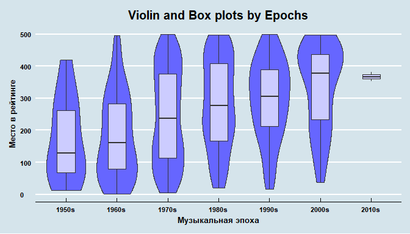
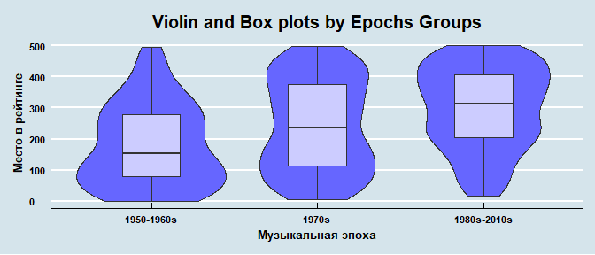

# Top 500 Rolling Stones Albums Analysis
Elvira Nassirova  
9 мая 2017 г   


## Введение

В данном исследовании мы проанализируем список альбомов из Топ-500 по версии Rolling Stones. Файл с данными можно скачать с ресурса [Datazar](https://www.datazar.com/file/fab8ac573-12b3-4b30-9f1d-2bd5ff62b1e8). Подробнее со списком можно ознакомиться на [официальном сайте](http://www.rollingstone.com/music/lists/500-greatest-albums-of-all-time-20120531).

В первую очередь, взглянем на имеющиеся данные. В датасете есть колонки: Number (Позиция в списке от 1 до 500), Year (год издания альбома), Album (Название альбома). Мы добавили колонку Epoch к исходному датасету, которая соотносит годы издания альбома к музыкальным эпохам (50-е, 60-е и т.д.).


**Table: Head of the Dataset**

| Position |  Year | Album                                  | Epoch |
|:-----:   | :---: | :------------------------------------- | :---: |
|      1   |  1967 | Sgt. Pepper's Lonely Hearts Club Band  | 1960s |
|      2   |  1966 | Pet Sounds                             | 1960s |
|      3   |  1966 | Revolver                               | 1960s |
|      4   |  1965 | Highway 61 Revisited                   | 1960s |
|      5   |  1965 | Rubber Soul                            | 1960s |
|      6   |  1971 | What's Going On                        | 1970s |


Теперь обратимся к статистике в разрезе эпох:

**Table: Descriptive statistics for Epochs**

|Epoch |   N   | Mean  | Median |   SD |
|:---  | ----: | ----: | ----:  | ----:|
|1950s |    10 |   172 |     128|   133|
|1960s |   105 |   182 |     161|   131|
|1970s |   186 |   243 |     236|   147|
|1980s |    85 |   282 |     277|   139|
|1990s |    72 |   294 |     306|   123|
|2000s |    40 |   334 |     378|   133|
|2010s |     2 |   367 |     367|    20|

На основе данной таблицы можем сделать несколько предварительных выводов и замечаний:

1. Наименьшее количество альбомов относится к эпохе 2010s (2). 

2. Минимальное медианное значение рейтинга относится к 1950s (128.5), максимальное -- 2000s (378).

3. Также наблюдаем, что с ростом значения Epoch увеличиваются и средние, и медианные значения рейтинга, т.е. более старые альбомы в среднем в рейтинге выше, чем новые.

## 1 Гипотеза

Исходя из последнего вывода мы предлагаем *следующую гипотезу* -- существуют статистически значимые различия в рейтингах альбомов в зависимости от эпохи, в которой они были выпущены (средние значения рейтинга каждой эпохи в ГС не равны). Для проверки данной гипотезы воспользуемся однофакторным дисперсионным анализом ANOVA.

## 2 Анализ

### 2.1 Графический анализ
Прежде всего построим графики ящиков с усами и violin plots для каждой эпохи.

<!-- -->

Можно заметить, что форма violin plot схожа у графиков 1950s и 1960s, у 1970s распределение более равномерное и симметричное, далее оно начинает сужаться в нижней части и к 2000s большинство оценок сосредоточено в верхней части графика, ровно как и медиана. Также бросается в глаза очень маленькое количество наблюдений в 2010s.

### 2.2 Однофакторный дисперсионный анализ
Был проведен анализ ANOVA с поправкой Тьюки, чтобы избежать ошибки множественных сравнений, и далее выведены только те пары наблюдений, для которых `p adj` меньше 0.05 (статистически значимые различия).


**Table: Tukey's HSD for ANOVA**

|Epochs Pairs | diff  | lwr |  upr  | p adj |
|:----------- | ----: | ---:|  ---: | -----:|
|2000s-1950s  |   162 |   18|   306 |   0.02|
|1970s-1960s  |    62 |   12|   111 |   0.00|
|1980s-1960s  |   100 |   40|   159 |   0.00|
|1990s-1960s  |   112 |   50|   174 |   0.00|
|2000s-1960s  |   152 |   77|   228 |   0.00|
|2000s-1970s  |    91 |   20|   162 |   0.00|

### 2.3 Группировка переменых и повторное проведение анализа
Видим, что 4 пары из 6 содержат в себе 1960s, две -- 1970s. Исходя из полученных рассчетов, мы решили объединить эпохи в группы в переменной Epoch2 в соответствии со схожестью распределения оценок внутри них. Первая группа -- **1950-1960s**, вторая -- **1970s**, третья -- **1980s-2010s**. Результаты ANOVA представлены ниже:


```
##              Df  Sum Sq Mean Sq F value  Pr(>F)    
## Epoch2        2 1004148  502074    26.5 1.1e-11 ***
## Residuals   497 9412477   18939                    
## ---
## Signif. codes:  0 '***' 0.001 '**' 0.01 '*' 0.05 '.' 0.1 ' ' 1
```

Полученные результаты, позволяют отвергнуть нулевую гипотезу о том, что средние значения рейтинга для полученных групп эпох равны. Проиллюстрируем это с помощью графика:

<!-- -->

## Вывод

Существуют статистически значимые различия в рейтингах альбомов в разрезе групп эпох. Альбомы более ранних годов получают более высокую оценку в рейтинге.
