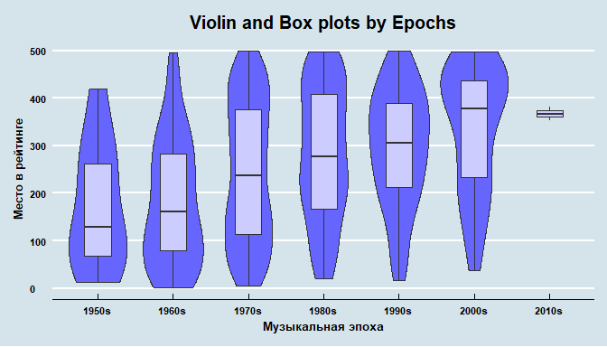
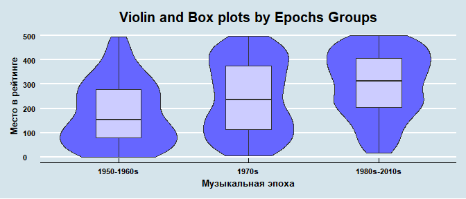

# Top 500 Rolling Stones Albums Analysis
Elvira N  
9 мая 2017 г   


## Введение

В данном исследовании мы проанализируем список альбомов из Топ-500 по версии Rolling Stones[^1]. Файл с данными можно скачать с ресурса [Datazar](https://www.datazar.com/file/fab8ac573-12b3-4b30-9f1d-2bd5ff62b1e8).

[^1]: Подробнее со списком можно ознакомиться на [официальном сайте](http://www.rollingstone.com/music/lists/500-greatest-albums-of-all-time-20120531).

В первую очередь, взглянем на имеющиеся данные. В датасете есть колонки: Number (Позиция в списке от 1 до 500), Year (год издания альбома), Album (Название альбома). Мы добавили колонку Epoch к исходному датасету, которая соотносит годы издания альбома к музыкальным эпохам (50-е, 60-е и т.д.).


Table: Head of the Dataset

 Number   Year  Album                                   Epoch 
-------  -----  --------------------------------------  ------
      1   1967  Sgt. Pepper's Lonely Hearts Club Band   1960s 
      2   1966  Pet Sounds                              1960s 
      3   1966  Revolver                                1960s 
      4   1965  Highway 61 Revisited                    1960s 
      5   1965  Rubber Soul                             1960s 
      6   1971  What's Going On                         1970s 


Теперь обратимся к статистике в разрезе эпох:

Table: Descriptive statistics for Epochs

Epoch      N   Mean   Median    SD
------  ----  -----  -------  ----
1950s     10    172      128   133
1960s    105    182      161   131
1970s    186    243      236   147
1980s     85    282      277   139
1990s     72    294      306   123
2000s     40    334      378   133
2010s      2    367      367    20

На основе данной таблицы можем сделать несколько предварительных выводов и замечаний:

1. Наименьшее количество альбомов относится к эпохе 2010s (2). 

2. Минимальное медианное значение рейтинга относится к 1950s (128.5), максимальное -- 2000s (378).

3. Также наблюдаем, что с ростом значения Epoch увеличиваются и средние, и медианные значения рейтинга, т.е. более старые альбомы в среднем в рейтинге выше, чем новые.

##1 Гипотеза

Исходя из последнего вывода мы предлагаем *следующую гипотезу* -- существуют статистически значимые различия в рейтингах альбомов в зависимости от эпохи, в которой они были выпущены (средние значения рейтинга каждой эпохи в ГС не равны). Для проверки данной гипотезы воспользуемся однофакторным дисперсионным анализом ANOVA.

##2 Анализ

### 2.1 Графический анализ
Прежде всего построим графики ящиков с усами и violin plots для каждой эпохи.

<!-- -->

Можно заметить, что форма violin plot схожа у графиков 1950s и 1960s, у 1970s распределение более равномерное и симметричное, далее оно начинает сужаться в нижней части и к 2000s большинство оценок сосредоточено в верхней части графика, ровно как и медиана. Также бросается в глаза очень маленькое количество наблюдений в 2010s.

### 2.2 Однофакторный дисперсионный анализ
Был проведен анализ ANOVA с поправкой Тьюки, чтобы избежать ошибки множественных сравнений, и далее выведены только те пары наблюдений, для которых `p adj` меньше 0.05 (статистически значимые различия).


Table: Tukey's HSD for ANOVA

               diff   lwr   upr   p adj
------------  -----  ----  ----  ------
2000s-1950s     162    18   306    0.02
1970s-1960s      62    12   111    0.00
1980s-1960s     100    40   159    0.00
1990s-1960s     112    50   174    0.00
2000s-1960s     152    77   228    0.00
2000s-1970s      91    20   162    0.00

### 2.3 Группировка переменых и повторное проведение анализа
Видим, что 4 пары из 6 содержат в себе 1960s, две -- 1970s. Исходя из полученных рассчетов, мы решили объединить эпохи в группы в переменной Epoch2 в соответствии со схожестью распределения оценок внутри них. Первая группа -- **1950-1960s**, вторая -- **1970s**, третья -- **1980s-2010s**. Результаты ANOVA представлены ниже:


```
##              Df  Sum Sq Mean Sq F value  Pr(>F)    
## Epoch2        2 1004148  502074    26.5 1.1e-11 ***
## Residuals   497 9412477   18939                    
## ---
## Signif. codes:  0 '***' 0.001 '**' 0.01 '*' 0.05 '.' 0.1 ' ' 1
```

Полученные результаты, позволяют отвергнуть нулевую гипотезу о том, что средние значения рейтинга для полученных групп эпох равны. Проиллюстрируем это с помощью графика:

<!-- -->

##Вывод

Существуют статистически значимые различия в рейтингах альбомов в разрезе групп эпох. Альбомы более ранних годов получают более высокую оценку в рейтинге.
